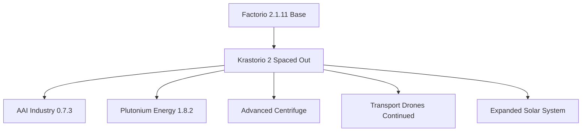

## Factorio: Krastorio 2 Spaced Out + 2.1.11 Meta-Analysis

### 🏗️ Philosophy & Execution Bounds

- **Core Motto**: _Everything is temporary, only progress is constant._
- **Playstyle Intent**: Treating the game as an intense **compiler and scaling optimization puzzle**. Prioritizing velocity over premature optimization to outrun biter evolution and prevent real-world burnout.
- **Execution Strategy**: Prototype first by force-feeding steel chests/mixed containers. Refactor the entire factory into highly aesthetic, perfectly balanced production columns once late-game planetary technologies are unlocked.
- **Constraints**:
    - **Permadeath**: Strict one-life roleplay. Character survival overrides all else.
    - **Ecological Awareness**: 100% concrete ban on Nauvis. Deep natural forests are treated as untouchable structural obstacles. Pollution minimized via K2 Air Purification, `tree-healing`, and natural absorption.
    - **Automation Split**: Stationary logistics bots are restricted purely to the automated building mall area. All world expansion is executed via personal roboports.

---

### ⚙️ Active Mod Architecture

The sandbox environment was completely rebuilt from a 2.0 structure into a highly complex **Factorio 2.1.11** runtime layer.

Core Pipeline Multipliers

- **3x Technology Cost**: Amplifies resource demands exponentially. Every fractional inefficiency at an early intermediate step multiplies geometrically at the apex of the research tree.
- **AAI Industry Override**: Deeply complicates basic recipes. Introduces intermediary sub-assemblies (Automation Cores, Iron Beams, Single-Cylinder Engines, Small Motors) into early structures.
- **Plutonium Energy & Advanced Centrifuge**: Completely overhauls the nuclear lifecycle. Disables standard Kovarex loops to prevent infinite U²³⁵ exploitation. Forces a complex isotopic cycle (Pu²³⁸ / Pu²³⁹ management, spent fuel cell reprocessing, and breeder reactors).
- **Transport Drones Continued Unofficial**: The baseline logistics method for the planetary surface. Eliminates the physical space overhead of train-based grids.

---

### 🗲 Infrastructure Patterns

1. Ground Logistics: The Centralized "Mixed-Container" Hub

- **The Problem**: AAI Industry introduces too many early-game intermediate parts, rendering traditional belt-based malls an engineering nightmare before logistics bots are unlocked.
- **The Solution**: A physical "Data Bus" architecture mimicking space platform hub processing.
- **Implementation**:
    - Sub-assembly machinery pumps items (Cores, Beams, Engines) directly into a central K2 Warehouse or connected group of Steel Chests.
    - Loaders/Inserters on the input side are hardwired via the **Circuit Network** to the storage container, utilizing strict conditions to prevent overflow (`Enable if [Item] < 400`).
    - End-product machine assemblers border the outside of the container, utilizing **Filter Inserters** to pull only their exact recipe requirements.

2. Space Logistics: The Symmetrical Multi-Planet Platform

- **Platform Drag Overhaul (`Rocs-Improved-Platform-Drag`)**: Wide horizontal hulls are no longer penalized. Aerodynamic drag is calculated purely on total tile mass, allowing for elongated, perfectly balanced vertical or square production blocks.
- **The Hub Buffer Technique**: The central Space Platform Hub acts as a massive global storage buffer, eliminating the need for banned chest structures in orbit.
- **The Interplanetary Resource Loop**: Platforms act as automated space trains executing a zero-fuel planetary drop loop:
    - **To Vulcanus**: Dropping free Carbon and Ice harvested from space to feed local chemical lines.
    - **To Nauvis**: Dropping free Iron and Steel caught from asteroids directly into planetary landing pads to bypass ground ore depletion.
- **Defensive Metrics**: Armor-Piercing (AP) Ammo is manufactured on-board using crushed metallic asteroid lines. AP rounds provide a 4x density compression math advantage over yellow ammo on sushi loops and hit with a higher baseline damage profile to break through the percentage-based resistances of Medium Asteroids.

---

### 🌌 Planetary Macro-Roadmap

Progressing quickly through the solar system is mandatory to bypass the rapid resource depletion of default world generation under a 3x multiplier. Crucial technologies are hard-gated by unique planetary resources.

[Nauvis Launchpad] 
       │
       ▼
[[Muluna (Nauvis Moon)]] ──► Unlocks: Helium-3, Space Tech Cards, & Rocket Thrusters
       │
       ▼
[[Vulcanus]]             ──► Unlocks: Tungsten, Foundries, Infinite Lava-to-Steam Power
       │
       ▼
[[Fulgora]]              ──► Unlocks: Heavy Scrap & Electromagnetic Plants
       │
       ▼
[[Cerys (Fulgora Moon)]] ──► Unlocks: Cryogenic Compounds (Requires 'Harder Pack' formatting)
       │
       ▼
[[Moshine (AI Planet)]]  ──► Unlocks: Neodymium, Computing Modules, & Maglev Space Trains
       │
       ▼
[Aquilo & Deep Space]    ──► End Game Tech

---

### ⚔️ Combat & Security Matrix

1. Nauvis Containment (Unmanned Static Defense)

- **The Threat**: Biters from default world generation reclaiming cleared spaces during extended off-planet absences.
- **The Wall Blueprint**: A continuous double-thick Steel Wall layout enclosing your 32 city-blocks.
- **The Array**: A 2-tile gap separates walls from a line of alternating **Laser Turrets** and Gun Turrets (supplied by local automated ammo loops).
- **The Logic**: Because `Repair Turrets` are currently in a version conflict with 2.1, lasers are mandatory. They act as a self-healing damage layer that cannot suffer from supply or ammo belt structural failure while you are on another planet.

2. Vulcanus Operations (Demolisher Engagement)

- **Worm Vulnerabilities**: Demolishers have 100% resistance to Lasers and Impact, and 99% resistance to Explosions. They are **only** vulnerable to Physical, Poison, and Electric damage.
- **Behavior Matrix**: They permanently delete physical walls on contact and regenerate health at a massive rate (Small: 2,400 HP/s). They have fixed territory zones; once killed, **they never respawn**, permanently freeing the land for Drone grid expansion.
- **The Killbox Execution**:
    1. Build a tight cluster of **30 to 40 Gun Turrets** fully within a verified safe island zone.
    2. Load the entire block with high-physical **Nuclear Rifle Magazines** or **Immersite Ammo**.
    3. Supplement the zone by pre-throwing 20–30 **Poison Capsules** across the worm's approach path to stack damage-over-time and halt its health regeneration.
    4. Aggro the head into the zone to output 5,000+ DPS, liquefying the worm instantly before its regeneration cycle can trigger.

